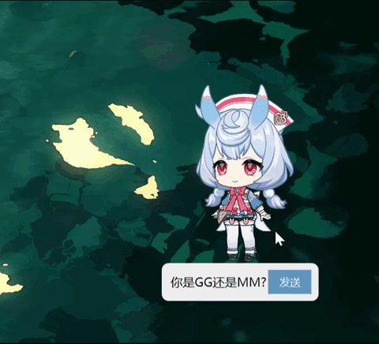
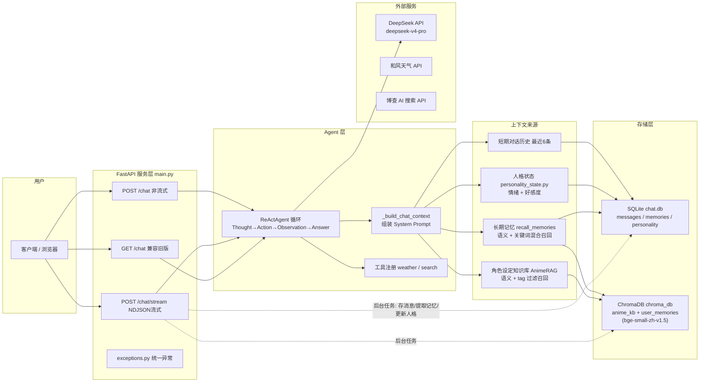

# AI Companion

基于 FastAPI 的二次元 AI 助手（希格雯），集成 ReAct Agent、长期记忆、RAG 知识库与人格模拟。

> 本项目以《原神》角色"希格雯"为交互载体，验证 AI 陪伴系统的技术可行性。核心架构（ReAct Agent / RAG / 双层记忆）可迁移至任意角色或企业客服场景。

## 演示



## 系统架构

> 本项目分为前后端两个独立仓库：
> - **后端**（本仓库）：FastAPI + ReAct Agent + RAG + 双层记忆
> - **前端**：[MyAIPet](https://github.com/Mew-2/MyAIPet) — .NET 10 WPF 客户端，透明置顶窗体，支持 NDJSON 流式打字机与情绪立绘切换



### 请求流转

1. 用户请求进入 FastAPI 接口（`/chat` 或 `/chat/stream`）。
2. `_build_chat_context` 组装 System Prompt：人格状态 + 短期历史 + 长期记忆召回 + RAG 角色设定。
3. `ReActAgent` 决策是否需要调用工具（和风天气 / 博查搜索），最终调用 DeepSeek LLM 生成回复。
4. 回复返回客户端；流式接口同时通过后台任务持久化消息、提取长期记忆、更新人格状态。

## 快速开始

```bash
# 1. 克隆后端（本仓库）和前端
git clone https://github.com/Mew-2/AI-Companion-Sigewinne.git
git clone https://github.com/Mew-2/MyAIPet.git
cd ai-companion

# 2. 创建虚拟环境（推荐）
python -m venv venv
source venv/bin/activate  # Linux/Mac
# venv\Scripts\activate  # Windows

# 3. 安装依赖
pip install -r requirements.txt

# 4. 配置环境变量
cp .env.example .env
# 编辑 .env，填入 DEEPSEEK_API_KEY、HEFENG_KEY 等

# 5. 一键初始化数据库与知识库
python reset_db.py

# 6. 启动服务
python main.py
# 访问 http://localhost:8000/docs 查看 Swagger API 文档
```

## 技术栈

- **后端**: FastAPI + Python 3.11
- **LLM**: DeepSeek API (deepseek-v4-pro)
- **Agent**: 手写 ReAct 循环，支持工具调用
- **记忆**: SQLite (短期历史) + ChromaDB + bge-small-zh-v1.5 (长期向量记忆)
- **RAG**: 语义召回 + tag 过滤，92 条单属性文档
- **前端**: .NET 10 WPF + Prism + MVVM，透明置顶窗体
- **协议**: NDJSON 流式，meta 前置驱动情绪切换

## 核心特性

- **手写 ReAct Runtime**: 不依赖 LangChain，Thought → Action → Observation 循环完全可控
- **双层记忆系统**: 短期对话历史 (SQLite) + 长期向量记忆 (ChromaDB 语义召回 + jieba 关键词兜底)
- **混合 RAG 检索**: 语义召回 + tag 命中补充，解决向量稀释问题
- **NDJSON 流式协议**: meta 包前置，WPF 客户端实时切换立绘与情绪
- **人格状态机**: 情绪/好感度动态衰减，影响回复语气
